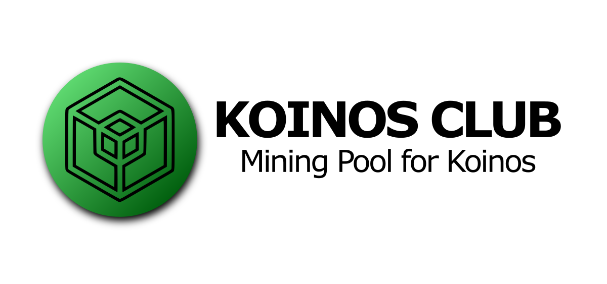

[](https://github.com/koinosclub/miner/issues)
[](https://github.com/koinosclub/miner/blob/main/LICENSE.md)

## Table of Contents
  - [Dependencies](#dependencies)
  - [Installation](#installation)
  - [Getting Started](#getting-started)
  - [Example Run](#example-run)
  - [FAQ](#FAQ)

## Dependencies

Prior to installation, you'll need to install the necessary dependencies.

### Linux

## Debian

```
sudo apt-get install git cmake build-essential libssl-dev
```

### macOS

On macOS, installing `gcc` is required to support OpenMP parallelization. Using the `brew` package manager, install OpenSSL and gcc.
```
brew install openssl gcc cmake
```

### Windows

On Windows, ensure that you are using the `MingW` compiler and you have installed `CMake`. Using the cholocately package manager, install OpenSSL.

```
choco install openssl
```

## Installation

For both Windows and Linux, you should be able to simply invoke the standard `npm` installer.

```
npm install
npm run postinstall
```

For macOS, you will need to specify the C compiler as `gcc`.

```
CC=gcc-10 npm install
```
## RPM based distributions

There is an all in one solution for RPM based distributions, that supply all the dependencies and the miner, as well as a sonfiguration file and systemd service.

## Fedora (tested on 32 and 33)

```
dnf install -y "https://github.com/joticajulian/koinos-miner/releases/download/0.0.1/koinos-miner-0.0.1-1.noarch.rpm" # You'll need EPEL repository
# edit /etc/koinos-miner/miner.conf with your user
systemctl enable --now koinos-miner.service
```

## CentOS 8

As a pre requiiste, you need to set nodejs distribution to version 12:

```
dnf module reset nodejs
dnf module enable nodejs:12
```

And then the rest is same as in Fedora:

```
dnf install -y "https://github.com/joticajulian/koinos-miner/releases/download/0.0.1/koinos-miner-0.0.1-1.noarch.rpm" # You'll need EPEL repository
# edit /etc/koinos-miner/miner.conf with your user
systemctl enable --now koinos-miner.service
```

## Getting started

You can view the CLI miner arguments by using `npm` like so:

```
npm start -- --help
```

And get the following output:

```
❯ npm start -- --help

> koinos-miner@1.0.0 start /path/to/koinos-miner
> node app.js "--help"

Usage: app [OPTIONS]...

Options:
  -v, --version                        output the version number
  -u, --user <user>                    Hive user
  -e, --pool-endpoint <pool endpoint>  A mining pool endpoint (default: "https://api.koinos.club")
  -p, --proof-period <seconds>         How often you want to submit a proof on average (default: "60")
```

**Hive user**: The `--user` argument specifies the recipient address, where the user will be rewarded with WKOINS.

**Pool Endpoint**: The `--pool-endpoint` argument specifies the url to connect with the mining pool api.

**Proof Period**: The `--proof-period` argument specifies the number of seconds on average the miner will attempt to mine and submit proofs. By default it is 60 seconds.

## Example Run

A simple example of running the miner:

```
❯ npm start -- -u jga
```

## Docker

You can run the miner using docker. Image size optimized to 250 MB:

```
docker run koinclub/miner:latest -u HIVE_USER
```
Additional docker flags that can be useful

```
--cpus XX [Specify the amount of CPUs to use for this container
--proof-period [How often you want to submit a proof on average (default: "60")]
--name [Specify name of container]
```

# FAQ

## Should I enter my private key in the miner?
No. You just need to provide the Hive user where you want to receive the mined koins. The mining pool will take care of submitting the proofs to the blockchain.

## Do I need a registration fee or funds on Ethereum?
No. You just need a Hive account, you will be rewarded there with WKOIN.

## What is WKOIN?
WKOIN is a wrapped KOIN created on Hive, and this token allow us to pay the miners with zero fees. You can redeem your KOINS at https://app.wkoin.buzz/.
Read more about WKOIN [here](https://hive.blog/koinos/@harpagon/introducing-wkoin-koin-erc-20-on-hive-engine).

## Can I use several miners with the same user?
Yes. You can set several miners. The mining pool will take care of assigning different tasks to each one in order to optimize the resources. 

## License

Copyright 2020 Open Orchard, Inc.

Koinos Miner is free software: you can redistribute it and/or modify
it under the terms of the GNU General Public License as published by
the Free Software Foundation, either version 3 of the License, or
(at your option) any later version.

Koinos Miner is distributed in the hope that it will be useful,
but WITHOUT ANY WARRANTY; without even the implied warranty of
MERCHANTABILITY or FITNESS FOR A PARTICULAR PURPOSE.  See the
GNU General Public License for more details.

You should have received a copy of the GNU General Public License
along with Koinos Miner.  If not, see <https://www.gnu.org/licenses/>.
